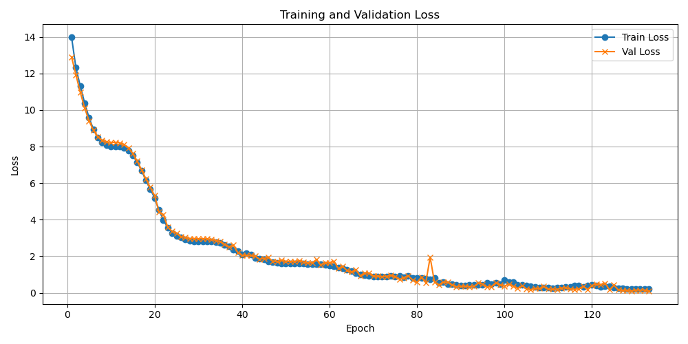
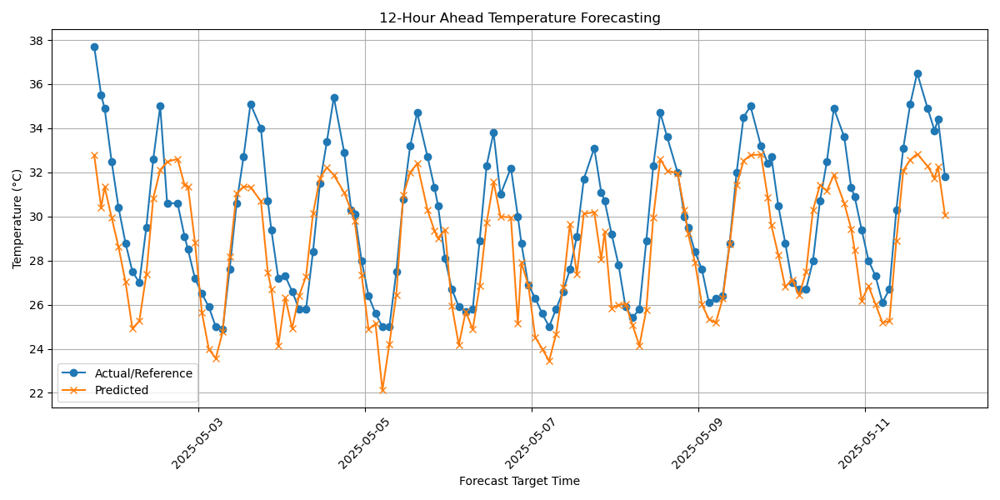

<div align="center">

# 📡 TempCastRNN


[](https://github.com/Rahul-JOON/Forecast-Journal)

**Hourly Forecast Refinement Using Temporal Attention**

</div>

---

## 📖 Project Overview

**TempCastRNN** is a transformer-based time series model that learns the temporal evolution of hourly weather forecasts to produce more accurate predictions for a target hour. It is designed to work seamlessly with the [Forecast Journal](https://github.com/Rahul-JOON/Forecast-Journal) repository, using its data to enhance predictive accuracy.

This repository implements the ML modeling component described in the Forecast Journal's roadmap. It takes historical 12×12 forecast matrices and predicts the accurate temperature at a 12-hour horizon using temporal attention.

---

## 🔍 Motivation

Weather forecasts update hourly, and those updates contain patterns. Instead of using only the latest forecast, this model leverages a sequence of previous hourly forecasts to learn how prediction patterns evolve.

The aim is to correct inaccuracies in the 12-hour forecast by recognizing trends in past forecast changes.

---

## 📚 Key Concepts

### 🔁 Recurrent Neural Networks (RNNs)

RNNs process sequences one timestep at a time and maintain memory of previous steps. While useful for sequential modeling, they struggle with long-range dependencies.

### ✨ Transformer & Attention

Transformers use self-attention to focus on important parts of the input sequence regardless of position. This allows the model to capture dependencies across the entire 12-hour forecasting sequence without vanishing gradients.

---

## ⚙️ Implementation

### 🧠 Core Idea

Each hour, the Forecast Journal repository records forecasts made for the next 12 hours. Stacking these for 12 hours forms a 12×12 matrix:

```notebook
Hour 0 → [T0, T1, ..., T11]
Hour 1 → [T1, T2, ..., T12]
...
Hour 11 → [T11, ..., T22]
```

This matrix is used to predict the true value of temperature at Hour 12.

### 🏗️ Model Architecture

- **Input**: 12×12 forecast matrix
- **Embedding**: Linear layer to encode each forecast vector
- **Transformer Encoder**: 2 layers with multi-head attention
- **Final Dense Layer**: Outputs a single scalar (predicted temperature)

```notebook
[12×12 Matrix] → Embedding → Transformer Encoder → Output (1 value)
```

### ❌ Masking Strategy

A causal mask is applied so each row (forecast made at hour `i`) only attends to itself and prior rows. This ensures that predictions are not influenced by future data.

### 🔁 Data Download Automation

The model automatically fetches training data by triggering a download request from the Forecast Journal frontend. It supports city-based filtering and dynamic date range selection directly from configuration:


Internally, this script:

- Sends an HTTP POST request to the dashboard's download endpoint.
- Parses and saves the returned CSV.
- Transforms it into a 12×12 tensor dataset.

---

## 🧪 Training

To begin training:

```bash
python model.py --cities Dwarka Najafgarh Hauz_Khas --start 2025-03-01 --end 2025-03-30 --mode train
```

- **Loss**: Smooth L1 Loss
- **Optimizer**: AdamW
- **Scheduler**: Cosine Annealing
- **Logging**: Epoch-wise training logs saved to `logs/train_logs/<timestamp>/`
- **Artifacts**: Model saved to `models/best_model.pth`, metadata as JSON

---

## 📊 Prediction & Evaluation

To evaluate model performance on a specific city and date range:

```bash
python model.py --cities Najafgarh Hauz_Khas --start 2025-04-01 --end 2025-04-30 -- mode evaluate
```

### 📝 Output
- Evaluation metrics are printed (MAE & RMSE)
- Results saved to:
  - `logs/eval_logs/eval_results_<timestamp>.json`
  - `logs/eval_logs/forecast_plot_<timestamp>.png`

---

## 🖋️ Evaluation Benchmarks

Latest Evaluation Results:

- **City**: test
- **Date**: May 1st to May 11th, 2025
- **MAE**: `1.698 °C`
- **RMSE**: `2.017 °C`

This indicates the model's ability to correct noisy forecasts with relatively low average and root mean squared error, especially given noisy multi-day forecasts.

Visual forecast comparisons and entry-wise results are available in the `eval_logs/` directory.




---

## 📅 Setup & Environment

Create the project environment using the provided `environment.yml`:

```bash
conda env create -f environment.yml
conda activate tempcastr
```

Dependencies include:
- Python 3.10+
- PyTorch
- Pandas
- NumPy
- Matplotlib
- scikit-learn

---

## 🔄 Full Pipeline: `model.py`

This script acts as a CLI wrapper for the entire workflow:

```bash
python model.py --help
```

### Available Commands:
- `train`: Train the model using synthetic or preprocessed data
- `evaluate`: Evaluate on downloaded CSVs for a city/time range
- Auto-handles model loading, mask generation, logging, and inference

---

## 📈 Visualization

Loss curves and forecast comparison plots are generated:

- Training loss example: `logs/train_logs/<timestamp>/loss_plot_*.png`
- Evaluation plot example: `logs/eval_logs/forecast_plot_*.png`

---

## 🙌 Contributions & Feedback

Open issues or submit pull requests to:
- Extend model architecture
- Improve training stability
- Contribute to Forecast Journal integration

> Built for real-world weather prediction correction using time-aware deep learning.
